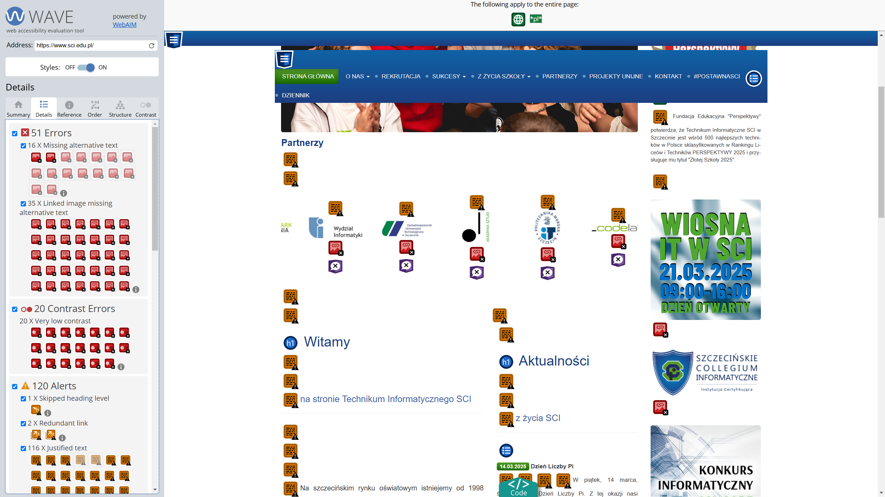
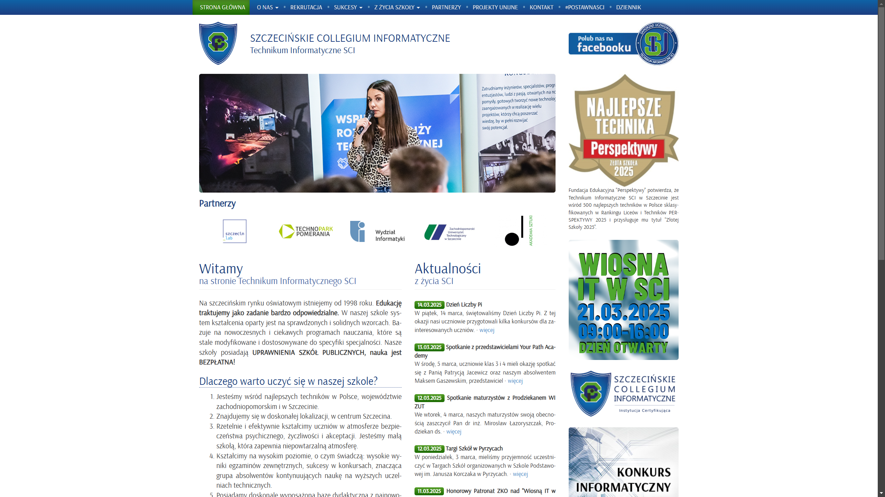
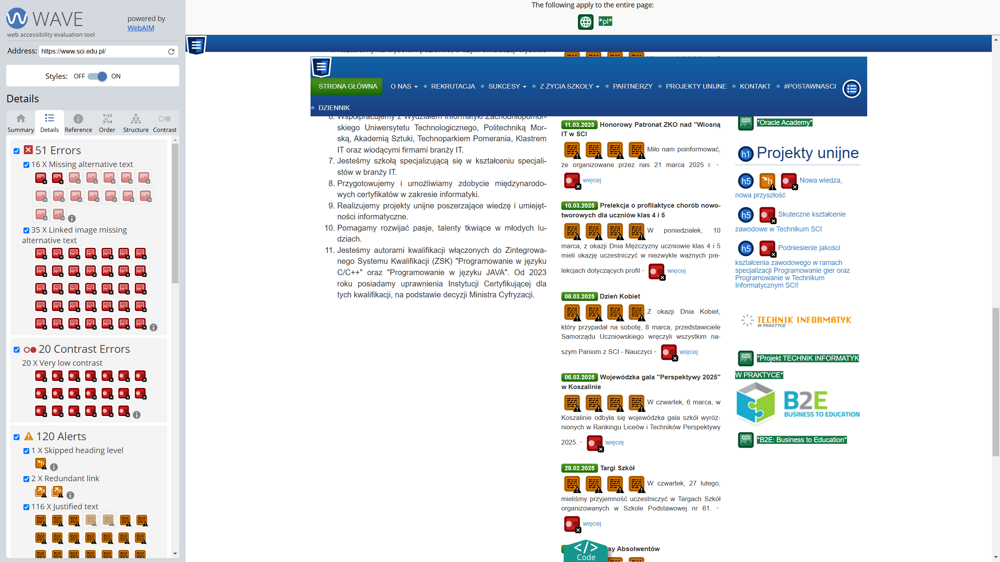
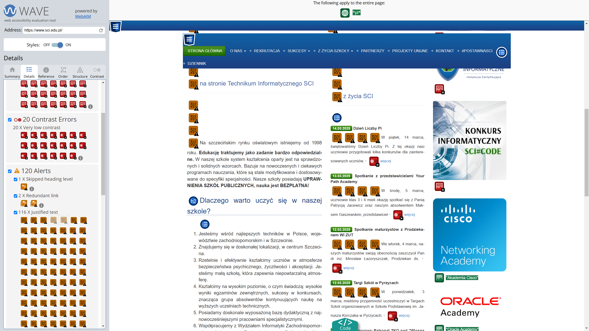
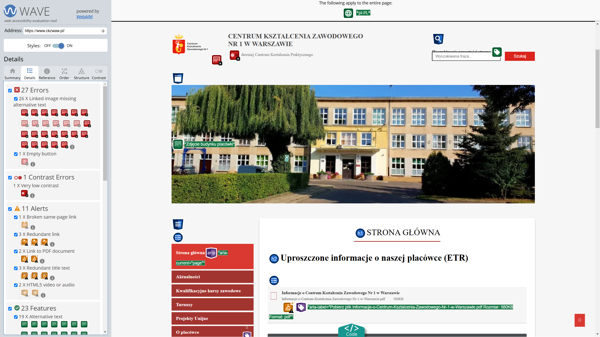
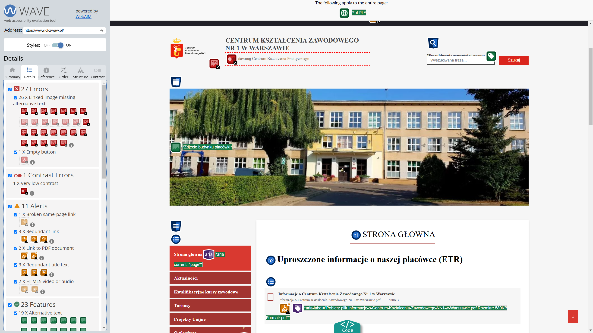

# Analiza strony sci.edu.pl

## Główne błędy:
### 1. **Brak tekstu alternatywnego**  

Rozwiązanie: dodanie tekstu alternatywnego w właściwości `alt`
### 2. **Słaba responsywność tekstu**  

Rozwiązanie: dodanie takiej możliwości
### 3. **Mało widoczny tekst**  

Rozwiązanie: zwiększenie kontrastu tekstu z tłem
### 4. **Mały rozmiar czcionki**  

Rozwiązanie: zwiększenie rozmiaru tekstu
### 5. **Złe użycie `text-align: justify`**  

Z tego powodu występują zbyt duże odstępy między wyrazami  
Rozwiąznie: zmniejszyć odstepy między wyrazami

# Analiza strony ckzwaw.pl

## Główne błędy:
1. **Brak tekstu alternatywnego**  

Rozwiązanie: dodanie tekstu alternatywnego w właściwości `alt`
2. **Mały widoczny tekst**  

Rozwiązanie: zwiększenie kontrastu tekstu z tłem